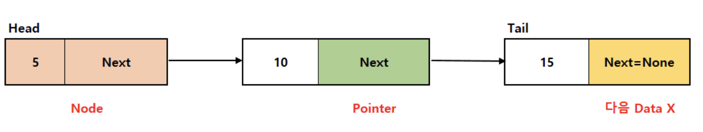

## 목차
1. [연결 리스트](#1.-연결-리스트)
2. [포인터를 이용한 연결 리스트](#2.-포인터를-이용한-연결-리스트)

## 1. 연결 리스트
<br>

### 연결 리스트 알아보기
* **리스트**는 순서가 있는 데이터를 늘어놓은 자료구조이다. 
* 구조가 단순한 리스트로 **선형 리스트(linear list)** 또는 **연결 리스트(linked list)** 가 있다. 

<p align = "center">

</p>
<p align = "center">
Fig.1 - Linked List 구조
</p>

* 연결 리스트의 구조 
    * Node: data, 뒤쪽 노드를 가리키는 pointer를 갖고 있는 element.
    * head node(맨 앞의 노드), tail node(맨 끝의 노드), predecessor node(각 노드 바로 앞의 노드), successor node(각 노드 바로 뒤의 노드)

### 배열로 연결 리스트 만들기
: 단순한 배열로 구현한 연결리스트는, 데이터 삽입 삭제 시 데이터를 옮겨야 하므로 비효율적이다. 

<br>

## 2. 포인터를 이용한 연결 리스트 
<br>

### 포인터로 연결 리스트 만들기
: 연결 리스트에 데이터 삽입 시, **노드용 인스턴스 생성**, 데이터 삭제 시 **노드용 인스턴스 삭제** 하면 배열에서의 데이터 옮기는 문제를 해결 가능.

* Node 코드
    * data : 데이터 자체가 아닌 '데이터에 대한 참조'
    * next : '다음 노드에 대한 참조'

```
from __future__ import annotations
frmo typing import Any, Type

class Node: //연결 리스트용 노드 클래스
    def __init__(self, data: Any = None, next: Node = None):
        self.data = data
        self.next = next
```
```
class LinkedList:
    def __init__(self) -> None:
        self.no = 0         # 노드의 개수
        self.head = None    # 머리 노드
        self.current = None # 주목 노드

    def __len__(self) -> int:
        #연결 리스트의 노드 개수 반환 
        return self.no
```

<br>

* 검색을 수행하는 search() 함수
    * 검색 종료 조건 2가지 //노드를 스캔할 때 다음 조건 가운데 하나만 성립해도 검색이 종료된다.  
        * 종료 조건 1: 검색 조건을 만족하는 노드가 없고, 꼬리 노드까지 온 경우
        * 종료 조건 2: 검색 조건을 만족하는 노드를 발견한 경우

```
def search(self, data: Any) -> int:
    #data와 값이 같은 걸 찾는 것
    cnt = 0         # 맨 앞에서 몇 번째 노드 스캔인지 확인하기 위한 카운터용 변수 cnt
    ptr = self.head

    while ptr is not None:
        if ptr.data == data:
            self.current = ptr
            return cnt
        cnt += 1
        ptr = ptr.next      #node의 data와 맞지 않는 경우 다음 node 준비
    return -1 


def __contains__ (self, data: Any) -> bool: 
    #연결 리스트에 data가 포함되어 있는지 search 함수를 통해 확인할 수 있음

return self.search(data) >= 0

```

* 머리에 노드를 삽입하는 add_first() 함수 
```
def add_first(self, data: Any) -> None:
    ptr = self.head
    self.head = self.current = Node(data, ptr)
    self.no += 1
```

* 꼬리에 노드를 삽입하는 add_last() 함수
: 여기서 리스트가 비어있는 경우를 고려한다. 
```
 def add_last(self, data: Any):
    if self.head is None:       # 리스트가 비어있는 경우
        self.add_first(data)    # 맨 앞에 노드를 삽입
    else:
        ptr = self.head
        while ptr.next is not None:
            ptr = ptr.next
        ptr.next = self.current = Node(data, None)
        self.no += 1
```

